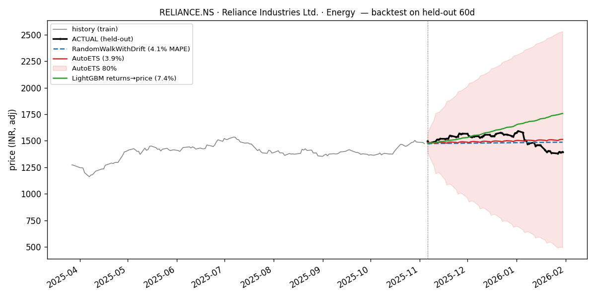
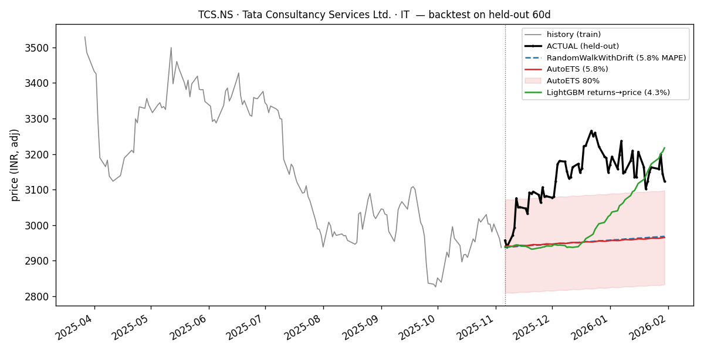
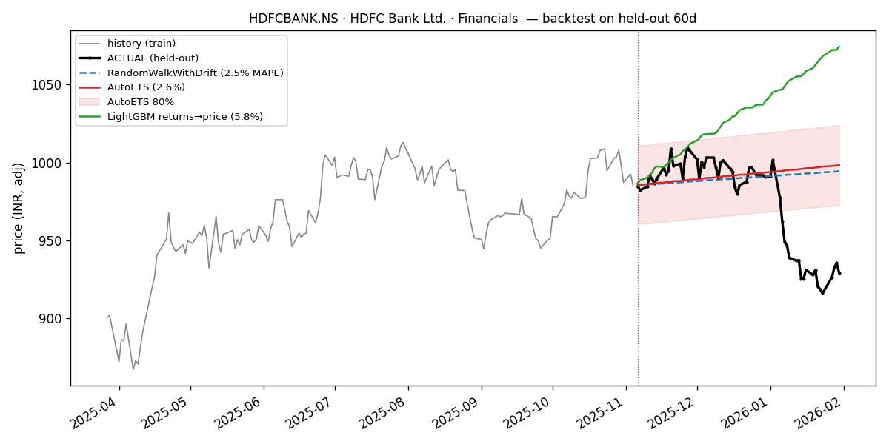
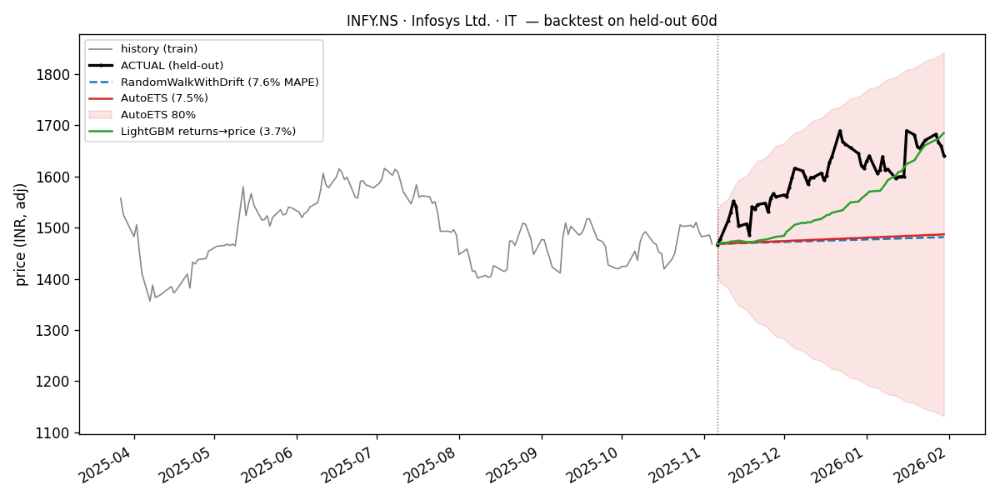
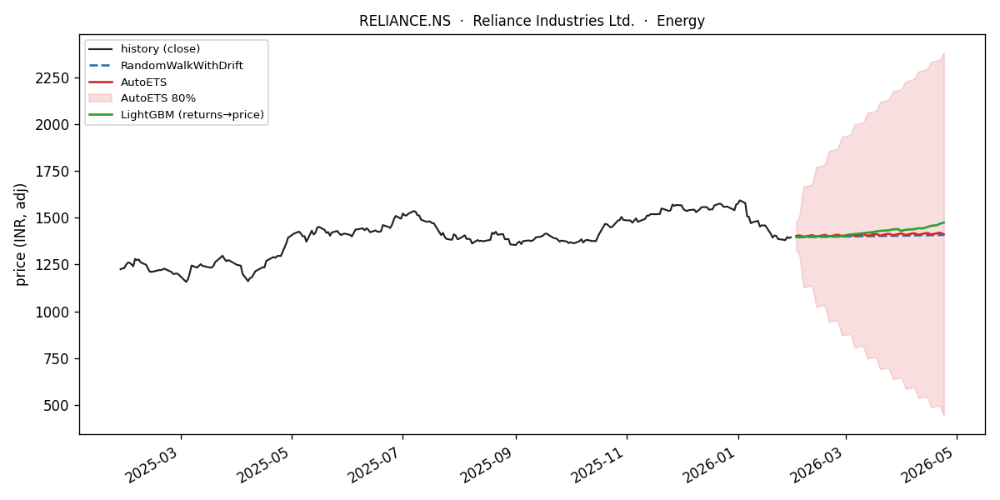
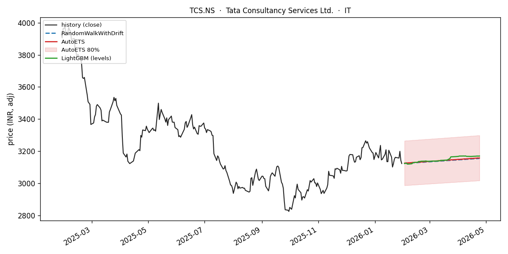
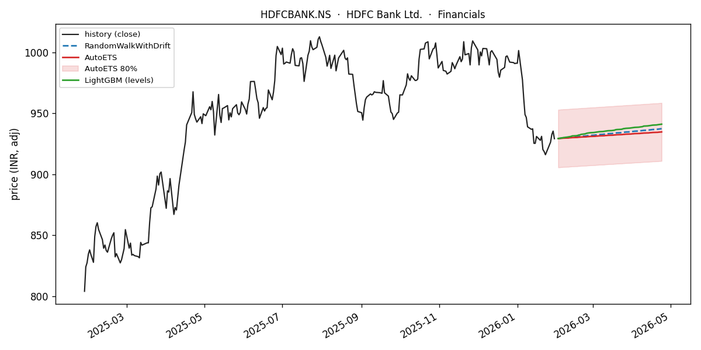
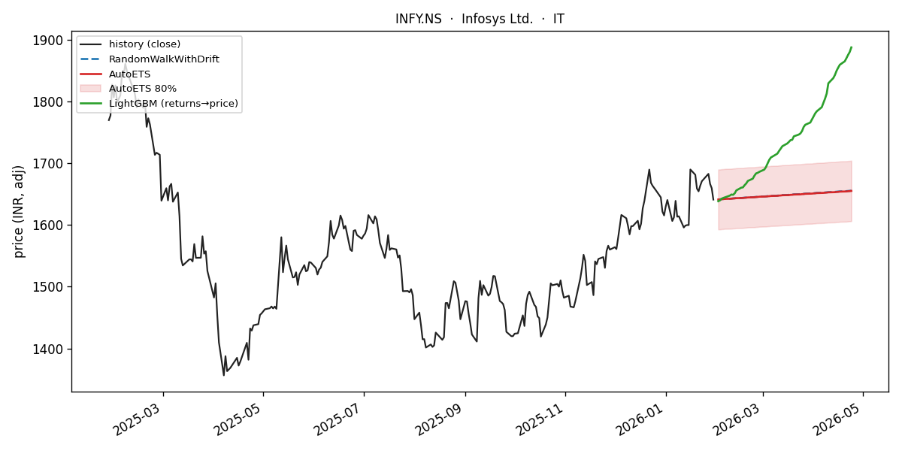
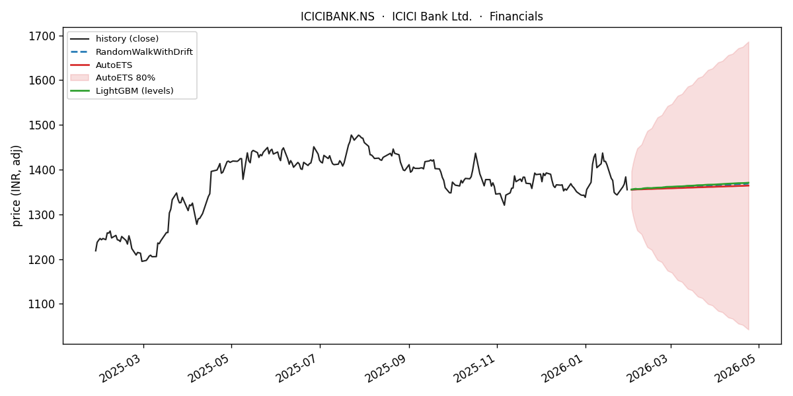
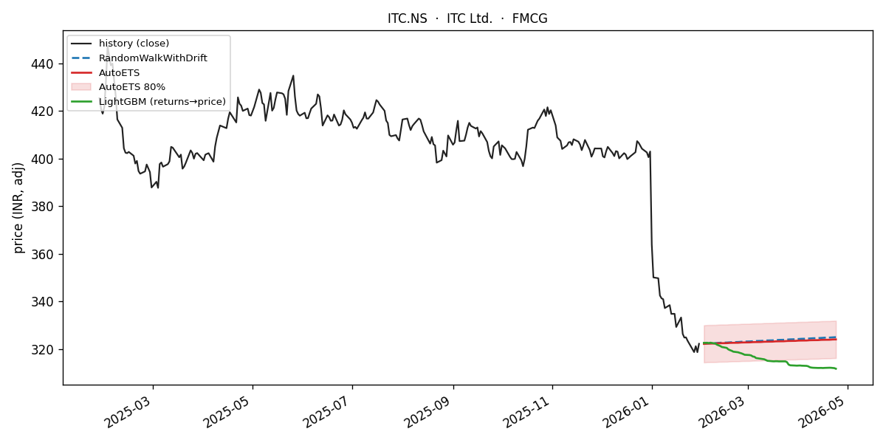

# Nifty50 Equity Forecasting Benchmark

[](LICENSE)

📄 **[Read the full thesis → `THESIS.md`](THESIS.md)** — complete methodology, mathematics, worked examples, plots, results, and references, written for a machine-learning audience.

A disciplined, **tier-based time-series forecasting benchmark** over 25+ years of
daily data for the 50 constituents of India's NSE Nifty 50 index — from trivial
baselines to per-series classical models to a global gradient-boosted model —
plus a **live forward forecast** of the next ~3 months per stock.

> Methodology mirrors the sibling `nav_forecast` project: *establish a floor with
> dumb baselines, then only believe a fancier model if it actually beats that
> floor.* The recurring lesson in finance is that **RandomWalkWithDrift on price
> levels is brutally hard to beat**, and that **forecasting returns** (stationary)
> is the honest framing.

- **Data:** Kaggle [`kalyan197/nifty50-stocks1999-2026-daily-ohlcv-and-fundamentals`](https://www.kaggle.com/datasets/kalyan197/nifty50-stocks1999-2026-daily-ohlcv-and-fundamentals) — ~88 MB, ~287K daily rows, **49 stocks** (of the Nifty 50), Jan 1999 → Jan 2026, sourced from Yahoo Finance, CC0.
- **Targets:** `close` (price level) **and** `log_return` (stationary).
- **Horizons:** 5 / 20 / 60 trading days (≈ 1 week / 1 month / 1 quarter).
- **Validation:** walk-forward CV, 6 folds, 60-day test windows, expanding train.
- **Metrics:** MAE, RMSE, sMAPE, **MASE** (scale-free; mean **and** median reported).
- **Hardware:** runs end-to-end on a Raspberry Pi 5 (4 cores, 8 GB) with thermal throttling.

## 🏁 Results at a glance

Mean **MASE** across 49 stocks × 6 walk-forward folds — *lower is better; MASE < 1 beats the in-sample seasonal-naive.* The **winning model** is shown per cell:

| Target | h = 5 d | h = 20 d | h = 60 d |
|---|:--:|:--:|:--:|
| **`close`** — price level | RWD `1.92` | LightGBM `3.39` | AutoCES `5.52` |
| **`log_return`** — stationary | HistoricAvg `0.40` | AutoETS `0.39` | AutoETS `0.39` |

> **Takeaway:** at every horizon the best model only **ties** the trivial floor — RandomWalkWithDrift on levels, "predict-the-average-return" on returns — to within ~1–2%. **Model complexity did not win.** The full 10-model × 3-horizon tables for both targets are in the [🏆 Leaderboard](#-leaderboard) section below.

---

## The dataset

One combined **long-format** file plus a summary and metadata:

| File | What it is |
|---|---|
| `nifty50_historical_data.csv` | Main panel — daily OHLCV + derived + fundamentals for all 49 tickers |
| `nifty50_summary_statistics.csv` | One-row-per-stock summary over the full period |
| `metadata.json` | Collection metadata |

**Main file columns:** `Date, Ticker (e.g. RELIANCE.NS), Company_Name, Sector,
Open, High, Low, Close (split/dividend-adjusted), Volume, Dividend, Stock_Split,
Daily_Return, Volatility_20D, MA_50, MA_200, Market_Cap, PE_Ratio, Forward_PE,
PEG_Ratio, Price_to_Book, Dividend_Yield, EPS, Beta, 52Week_High, 52Week_Low`.

Run `./run.sh eda.py` for the full data-understanding report. Headline EDA
findings are injected below after each run:

<!-- EDA_FINDINGS -->
- **Shape:** 287,310 rows × 26 columns, **49 tickers** (the dataset ships 49 of
  the Nifty 50), daily, **1999-01-01 → 2026-01-30**.
- **History per ticker:** min 2,027 · median 5,858 · max 6,770 rows. All 49 reach
  ≥ 2026-01-01, so all 49 pass the eligibility filter.
- **Sectors (13):** Financials 10, IT 6, FMCG 5, Automobile 5, Metals 4, Pharma 4,
  Infrastructure 3, Cement 3, Energy 3, Consumer Durables 2, Power 2, Telecom 1,
  Healthcare 1.
- **Leakage proof ✅:** every one of the 10 fundamentals (`Market_Cap, PE_Ratio,
  Forward_PE, PEG_Ratio, Price_to_Book, Dividend_Yield, EPS, Beta, 52Week_High,
  52Week_Low`) is **constant within 49/49 tickers** → confirmed point-in-time
  snapshots → dropped. (`PEG_Ratio` is 100% null anyway.)
- `Daily_Return` exactly equals `Close.pct_change()` (mean |diff| = 0.0) — it is
  just a convenience column; we recompute trailing features inside the models.
- **Survivorship:** 29/49 tickers list after 2000 (e.g. HDFCLIFE & SBILIFE 2017,
  LTIM 2016, COALINDIA 2010) — the panel is current constituents only.
<!-- /EDA_FINDINGS -->

### ⚠️ Two hazards this project handles explicitly

1. **Fundamentals are point-in-time snapshots, not history.** `PE_Ratio`,
   `Market_Cap`, `EPS`, `Beta`, `Forward_PE`, `PEG_Ratio`, `Price_to_Book`,
   `Dividend_Yield`, `52Week_High/Low` are the *current (2026)* values repeated
   on every historical row. `eda.py` proves this (`n_unique == 1` per ticker).
   Using them as time-varying features is **lookahead leakage**, so they are
   **dropped** from the modelling panel. Only `Close` (→ `close`, `log_return`)
   and `Sector` (static) are used.
2. **Survivorship bias.** The panel contains only the *current* index members,
   so long-dead names are missing and winners are over-represented. This is not
   fixable from the data and is reported as a limitation.

The pre-computed `Daily_Return / Volatility_20D / MA_50 / MA_200` have unknown
provenance, so trailing features are **recomputed inside the models** rather than
trusted.

---

## Methodology

See [`methods.md`](methods.md) for the full tier roadmap. In short:

| Tier | Models | Idea |
|---|---|---|
| **0 — baselines** | Naive, SeasonalNaive(5), RandomWalkWithDrift, HistoricAverage, WindowAverage(20) | The floor every later tier must beat. |
| **1 — classical** | AutoARIMA, AutoETS, AutoTheta, AutoCES (season 5) | Per-series Box-Jenkins / state-space / theta. Feasible at 50 series. |
| **2 — global ML** | LightGBM (mlforecast): lags + rolling stats + `sector` | One model pools all tickers; usually wins on returns. |

**Live forecast:** models are refit on all history and projected ~60 business
days forward — RandomWalkWithDrift + AutoETS (with 80/95% intervals) on levels,
LightGBM on returns integrated to a price path.

---

## 🏆 Leaderboard

Walk-forward CV, cross-fold + cross-stock means; **lower MASE is better**
(MASE < 1 beats the in-sample seasonal-naive). Regenerated by
`build_scoreboard.py` (full interactive version in `scoreboard.html`).

<!-- LEADERBOARD -->
<!-- generated by build_scoreboard.py -->

#### Target: `close`

**Horizon 5 trading days** — ranked by MASE (lower is better)

| Rank | Model | MASE | MASE (median) | MAE | RMSE | sMAPE |
|---:|:--|--:|--:|--:|--:|--:|
| 1 | `tier0:RWD` | 1.922 | 1.370 | 47.67 | 53.92 | 0.007875 |
| 2 | `tier1:CES` | 1.927 | 1.358 | 47.44 | 53.76 | 0.007889 |
| 3 | `tier1:AutoTheta` | 1.927 | 1.388 | 47.58 | 53.92 | 0.007895 |
| 4 | `tier0:Naive` | 1.933 | 1.363 | 48.07 | 54.43 | 0.00793 |
| 5 | `tier2:lgb` | 1.934 | 1.383 | 52.09 | 58.29 | 0.007918 |
| 6 | `tier1:AutoETS` | 1.951 | 1.376 | 48.96 | 55.38 | 0.007978 |
| 7 | `tier1:AutoARIMA` | 2.023 | 1.436 | 50.33 | 56.83 | 0.008207 |
| 8 | `tier0:SeasonalNaive` | 2.482 | 1.819 | 61.41 | 68.82 | 0.01021 |
| 9 | `tier0:WindowAverage` | 3.117 | 2.258 | 88.65 | 93.5 | 0.01291 |
| 10 | `tier0:HistoricAverage` | 86.628 | 86.932 | 2241 | 2242 | 0.5354 |

**Horizon 20 trading days** — ranked by MASE (lower is better)

| Rank | Model | MASE | MASE (median) | MAE | RMSE | sMAPE |
|---:|:--|--:|--:|--:|--:|--:|
| 1 | `tier2:lgb` | 3.393 | 2.706 | 96.41 | 111 | 0.0139 |
| 2 | `tier1:CES` | 3.393 | 2.653 | 92.83 | 107.7 | 0.01398 |
| 3 | `tier0:RWD` | 3.416 | 2.747 | 93.74 | 108.6 | 0.01403 |
| 4 | `tier1:AutoTheta` | 3.431 | 2.765 | 93.74 | 108.7 | 0.0141 |
| 5 | `tier1:AutoETS` | 3.434 | 2.729 | 94.25 | 109.2 | 0.01418 |
| 6 | `tier0:Naive` | 3.464 | 2.750 | 94.53 | 109.5 | 0.01427 |
| 7 | `tier0:SeasonalNaive` | 3.831 | 2.947 | 100.5 | 117.1 | 0.01575 |
| 8 | `tier1:AutoARIMA` | 4.104 | 2.820 | 116.9 | 135.7 | 0.01627 |
| 9 | `tier0:WindowAverage` | 4.107 | 3.125 | 117.9 | 131.3 | 0.01706 |
| 10 | `tier0:HistoricAverage` | 87.391 | 88.489 | 2260 | 2261 | 0.5376 |

**Horizon 60 trading days** — ranked by MASE (lower is better)

| Rank | Model | MASE | MASE (median) | MAE | RMSE | sMAPE |
|---:|:--|--:|--:|--:|--:|--:|
| 1 | `tier1:CES` | 5.521 | 4.580 | 160.5 | 188.4 | 0.02277 |
| 2 | `tier1:AutoETS` | 5.552 | 4.334 | 161 | 188.5 | 0.02305 |
| 3 | `tier0:RWD` | 5.579 | 4.314 | 162.3 | 189.8 | 0.02293 |
| 4 | `tier2:lgb` | 5.582 | 4.568 | 166.2 | 193.6 | 0.02284 |
| 5 | `tier1:AutoTheta` | 5.602 | 4.357 | 162.9 | 190.4 | 0.02302 |
| 6 | `tier0:Naive` | 5.713 | 4.411 | 165 | 192.8 | 0.02355 |
| 7 | `tier0:SeasonalNaive` | 6.010 | 4.873 | 169.3 | 198.5 | 0.02471 |
| 8 | `tier0:WindowAverage` | 6.097 | 4.927 | 179.3 | 206.6 | 0.0251 |
| 9 | `tier1:AutoARIMA` | 7.978 | 4.648 | 243 | 283.3 | 0.03057 |
| 10 | `tier0:HistoricAverage` | 88.531 | 87.603 | 2287 | 2290 | 0.5405 |

#### Target: `log_return`

**Horizon 5 trading days** — ranked by MASE (lower is better)

| Rank | Model | MASE | MASE (median) | MAE | RMSE | sMAPE |
|---:|:--|--:|--:|--:|--:|--:|
| 1 | `tier0:HistoricAverage` | 0.396 | 0.342 | 0.008958 | 0.01095 | 0.8582 |
| 2 | `tier1:AutoETS` | 0.396 | 0.346 | 0.008962 | 0.01096 | 0.86 |
| 3 | `tier2:lgb` | 0.397 | 0.347 | 0.008996 | 0.01102 | 0.8355 |
| 4 | `tier1:AutoARIMA` | 0.400 | 0.345 | 0.009061 | 0.01105 | 0.8591 |
| 5 | `tier0:WindowAverage` | 0.408 | 0.350 | 0.009229 | 0.01129 | 0.797 |
| 6 | `tier1:AutoTheta` | 0.414 | 0.371 | 0.009386 | 0.01146 | 0.8048 |
| 7 | `tier1:CES` | 0.562 | 0.470 | 0.01282 | 0.01489 | 0.7405 |
| 8 | `tier0:SeasonalNaive` | 0.577 | 0.528 | 0.01306 | 0.01605 | 0.7328 |
| 9 | `tier0:Naive` | 0.580 | 0.486 | 0.01323 | 0.0153 | 0.7322 |
| 10 | `tier0:RWD` | 0.581 | 0.486 | 0.01323 | 0.0153 | 0.7323 |

**Horizon 20 trading days** — ranked by MASE (lower is better)

| Rank | Model | MASE | MASE (median) | MAE | RMSE | sMAPE |
|---:|:--|--:|--:|--:|--:|--:|
| 1 | `tier1:AutoETS` | 0.388 | 0.374 | 0.008723 | 0.01142 | 0.8655 |
| 2 | `tier0:HistoricAverage` | 0.388 | 0.374 | 0.008725 | 0.01142 | 0.8634 |
| 3 | `tier1:AutoARIMA` | 0.391 | 0.375 | 0.008794 | 0.0115 | 0.8706 |
| 4 | `tier2:lgb` | 0.392 | 0.381 | 0.008808 | 0.01152 | 0.8328 |
| 5 | `tier0:WindowAverage` | 0.403 | 0.390 | 0.009066 | 0.01181 | 0.8065 |
| 6 | `tier1:AutoTheta` | 0.404 | 0.390 | 0.009086 | 0.01183 | 0.8041 |
| 7 | `tier1:CES` | 0.560 | 0.478 | 0.01278 | 0.01539 | 0.7429 |
| 8 | `tier0:SeasonalNaive` | 0.569 | 0.530 | 0.01283 | 0.0162 | 0.7324 |
| 9 | `tier0:Naive` | 0.575 | 0.487 | 0.01309 | 0.01568 | 0.7335 |
| 10 | `tier0:RWD` | 0.576 | 0.488 | 0.0131 | 0.01569 | 0.7337 |

**Horizon 60 trading days** — ranked by MASE (lower is better)

| Rank | Model | MASE | MASE (median) | MAE | RMSE | sMAPE |
|---:|:--|--:|--:|--:|--:|--:|
| 1 | `tier1:AutoETS` | 0.391 | 0.380 | 0.008817 | 0.01191 | 0.865 |
| 2 | `tier0:HistoricAverage` | 0.392 | 0.382 | 0.008822 | 0.01191 | 0.8635 |
| 3 | `tier1:AutoARIMA` | 0.395 | 0.384 | 0.008888 | 0.01197 | 0.8739 |
| 4 | `tier2:lgb` | 0.398 | 0.390 | 0.008974 | 0.01205 | 0.819 |
| 5 | `tier0:WindowAverage` | 0.405 | 0.394 | 0.009116 | 0.01223 | 0.801 |
| 6 | `tier1:AutoTheta` | 0.405 | 0.392 | 0.00913 | 0.01225 | 0.7985 |
| 7 | `tier0:SeasonalNaive` | 0.566 | 0.531 | 0.01275 | 0.01632 | 0.7306 |
| 8 | `tier0:Naive` | 0.581 | 0.483 | 0.01329 | 0.0162 | 0.7382 |
| 9 | `tier0:RWD` | 0.583 | 0.482 | 0.01332 | 0.01624 | 0.7381 |
| 10 | `tier1:CES` | 0.689 | 0.472 | 0.01643 | 0.02184 | 0.75 |

<!-- /LEADERBOARD -->

---

## 🎯 Backtest: forecasts vs. actuals

The leaderboard says *how wrong* each model is; these charts let you **see it**. Same style
as the live charts, but on the **last 60 held-out trading days where the truth is known** —
the visual counterpart of the MASE numbers. Train ends at the dotted line; **black is the
realized price**. Mean MAPE over the window: **RWD 4.45% · AutoETS 4.59% · LightGBM 6.07%** —
the flat drift baselines hug the actual path more closely than the "smarter" tree, exactly as
the leaderboard implies (and the realized path stays inside AutoETS's 80% band). Full set in
`assets/backtest/`; reproduce with `./run.sh backtest_plot.py`.

 
 

---

## 📈 Live forward forecasts

Next ~60 business days per stock — black = history, dashed blue = RandomWalkWithDrift,
red = AutoETS (with 80% band), green = LightGBM (returns → price). Full gallery in
`assets/forecasts/`.

<!-- FORECAST_GALLERY -->







_Full 49-stock gallery in `assets/forecasts/` and `scoreboard.html`._
<!-- /FORECAST_GALLERY -->

---

## Project structure

```
equity_forecast/
├── setup.sh                 one-shot: shared venv on SSD + pinned deps + Kaggle download
├── run.sh                   wrapper: activate venv + headless matplotlib
├── requirements.txt         pinned, ARM/py3.13-proven stack
├── data.py                  CSV → parquet panel (Nixtla long format) + static
├── splits.py                walk-forward CV + eligibility
├── metrics.py               multi-horizon MAE/RMSE/sMAPE/MASE
├── eda.py                   dataset understanding + leakage/survivorship proof
├── thermal.py               Pi thermal-throttle helper (no-op off-Pi)
├── tier0_baselines/run_baselines.py
├── tier1_classical/run_classical.py
├── tier2_global_ml/run_global.py
├── live_forecast.py         refit-on-all + forward charts
├── build_scoreboard.py      leaderboard → scoreboard.html + README
├── methods.md               tier roadmap
└── assets/forecasts/        committed forecast charts
```

Data, venv, and per-tier metric CSVs live on `/mnt/ssd/equity_forecast/` (kept
out of git); the committed artifacts are the code, `scoreboard.html`, and
`assets/`.

## How to run

```bash
./setup.sh                                   # venv + deps + dataset (one time)
./run.sh data.py materialise                 # build parquet panel
./run.sh eda.py                              # understand the data
./run.sh tier0_baselines/run_baselines.py    # baselines
./run.sh tier1_classical/run_classical.py    # classical
./run.sh tier2_global_ml/run_global.py        # global LightGBM
./run.sh live_forecast.py                    # forward forecast + charts
./run.sh build_scoreboard.py                 # leaderboard + scoreboard.html
```

## Key findings

<!-- FINDINGS -->
**All tiers complete.** One-line takeaway: on **price levels** nothing meaningfully
beats RandomWalkWithDrift, and on **returns** the best a model does is recover the
drift — where tier-1 **AutoETS** and the trivial HistoricAverage baseline tie for
first. Complexity did not pay off here.

1. **On price levels the whole field sits within a whisker of RandomWalkWithDrift.**
   At h=60 the classical state-space models just edge it — AutoCES (MASE **5.521**)
   and AutoETS (5.552) beat RWD (5.579) — while at h=5 RWD is #1 and at h=20 it
   ties LightGBM. The spread across the top six models is < 2%. Translation:
   nothing *meaningfully* beats "yesterday's price + drift" on levels; the
   classical wins are real but within noise.
2. **On levels, AutoARIMA is the weakest classical model** (MASE 7.98 at h=60 vs
   ≈ 5.5 for ETS/Theta/CES) — its weekly-seasonal (`m=5`) stepwise search overfits
   daily prices *and* costs ~25 min/fold. ETS/Theta/CES are both better and far
   cheaper.
3. **On returns, "predict the drift" wins — and AutoETS does it best.** At h=20/60
   tier-1 **AutoETS** (MASE 0.388 / 0.391) leads, tying HistoricAverage and just
   ahead of LightGBM (0.392 / 0.398); all cluster at ≈ 0.39–0.41. Models that chase
   the *last* return (Naive / RWD / SeasonalNaive) sit at ≈ 0.58. The exception is
   **AutoCES** (≈ 0.56): it failed to fit some noisy return series and fell back to
   Naive (handled gracefully via `fallback_model`). Every return model beats the
   in-sample seasonal-naive (MASE < 1) — daily returns are otherwise near-random.
4. **Global ML pooling helps marginally, not decisively.** One LightGBM across all
   49 tickers + sector matches the best baselines but does not clearly beat them —
   at 49 liquid large-caps with adjusted prices there is little extra
   point-forecast signal to extract at 1-week to 1-quarter horizons.
5. **Sanity checks pass:** HistoricAverage is a trap on levels (MASE ≈ 87 — the
   25-year mean price is meaningless for a trending stock), and error grows
   monotonically with horizon (levels MASE 1.9 → 3.4 → 5.6 for 5 → 20 → 60d).
<!-- /FINDINGS -->

## Limitations

- **Survivorship bias** — current constituents only.
- **Fundamentals dropped** — point-in-time snapshots would leak.
- **No embargo/purging** in the walk-forward CV yet (future tier-7 work).
- **B-day grid + ffill** approximates the NSE holiday calendar.
- Adjusted `Close` means dividends/splits are baked in (good for returns).

## License & attribution

- **Code:** MIT — see [`LICENSE`](LICENSE).
- **Data:** *"Nifty50 Stocks (1999–2026) Daily OHLCV & Fundamentals"* by Kaggle user
  **kalyan197**, released **CC0 (public domain)** and sourced from Yahoo Finance —
  [kaggle.com/datasets/kalyan197/…](https://www.kaggle.com/datasets/kalyan197/nifty50-stocks1999-2026-daily-ohlcv-and-fundamentals).
  CC0 waives any attribution requirement, but the dataset author is credited here with thanks.

This is a research/educational benchmark, **not investment advice**.
