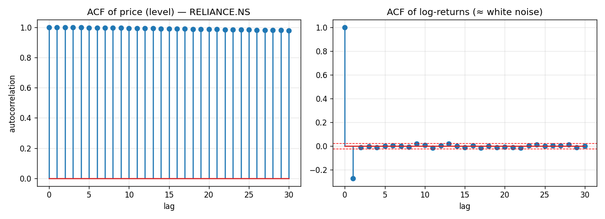
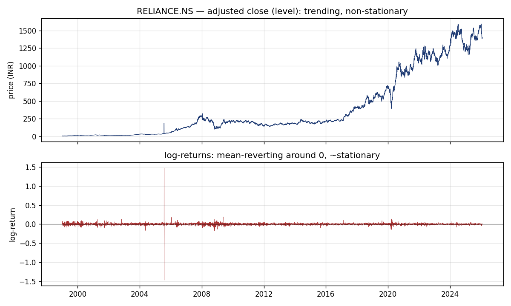
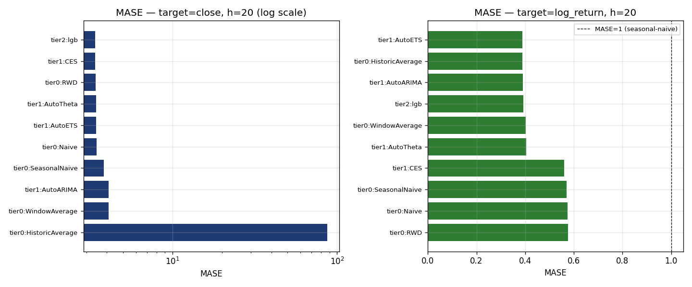
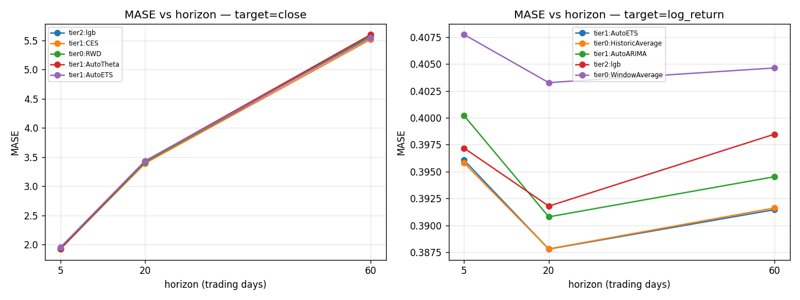
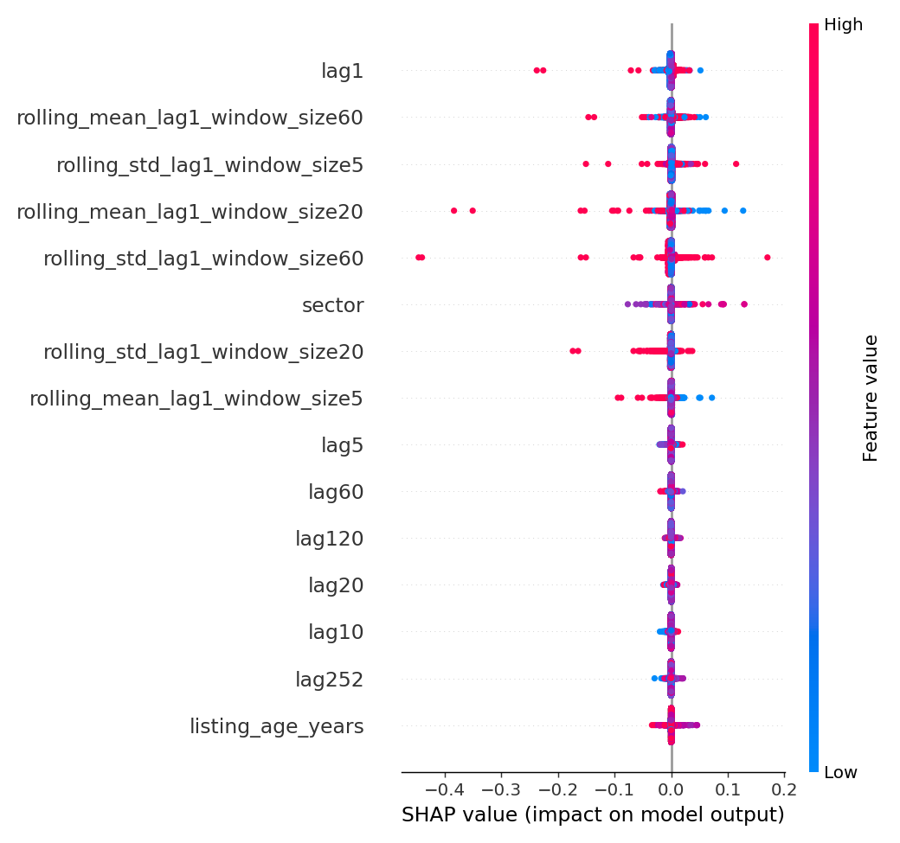

# Forecasting the Nifty 50: A Tiered Benchmark, and Why Complexity Did Not Win

*A self-contained thesis for readers who know machine learning but not (yet) time-series forecasting.*

---

## Abstract

We build a disciplined, reproducible benchmark for **daily price forecasting** of the
49 stocks shipped in a Kaggle "Nifty 50, 1999–2026" dataset. Three tiers of models —
trivial baselines, classical per-series statistical models, and a global
gradient-boosted tree — are evaluated under **walk-forward cross-validation** at three
horizons (1 week, 1 month, 1 quarter), for **two target framings** (price *levels* and
*log-returns*), using the scale-free **MASE** metric. The headline result is negative
and, we argue, instructive: **no model reliably beats a random walk with drift on price
levels, and on returns the best models merely recover the drift.** A LightGBM trained
across all stocks matches but does not beat trivial baselines. The contribution is
therefore *methodological* rather than a new predictor: an honest, leakage-audited
pipeline that (i) proves the dataset's "fundamentals" are look-ahead-leaking snapshots
and drops them, (ii) frames the target correctly, and (iii) validates without temporal
leakage — the three things that matter far more than model choice in financial
forecasting. Everything runs end-to-end on a Raspberry Pi 5.

**Repository:** code, interactive scoreboard, and 49 live forward-forecast charts accompany this document.

---

## Table of contents

1. [Introduction and thesis statement](#1-introduction-and-thesis-statement)
2. [Background for the ML reader](#2-background-for-the-ml-reader)
3. [Problem formulation and notation](#3-problem-formulation-and-notation)
4. [The data](#4-the-data)
5. [Methodology](#5-methodology)
6. [Experimental setup](#6-experimental-setup)
7. [Results](#7-results)
8. [Discussion](#8-discussion)
9. [Limitations](#9-limitations)
10. [Future work](#10-future-work)
11. [Reproducing this work](#11-reproducing-this-work)
12. [References](#references)
13. [Appendix](#appendix)

---

## 1. Introduction and thesis statement

If you come from machine learning, your instinct on being handed 25 years of daily stock
prices is probably: engineer features, throw a gradient-boosted tree or an LSTM at it,
tune, and watch the error fall. This project is, in part, a cautionary tale about that
instinct.

Financial price series are *adversarial* to the usual ML workflow in three specific ways,
and each one sinks naive pipelines:

1. **The data are ordered and non-stationary.** Random shuffling, i.i.d. assumptions, and
   ordinary k-fold cross-validation — all standard in ML — are *wrong* here and silently
   inflate your scores.
2. **The "obvious" target is the wrong one.** Predicting the *price* lets a model win by
   simply echoing yesterday's price; predicting the *return* is the honest, stationary
   problem — and it is close to unpredictable.
3. **Leakage is subtle and lethal.** A feature column that looks innocent (a P/E ratio)
   can encode the future, and a validation split that looks fine can leak tomorrow into
   today.

> **Thesis statement.** *Under correct target framing, leakage auditing, and walk-forward
> validation, model complexity provides no reliable edge over trivial baselines for daily
> Nifty-50 point forecasts. A random walk with drift is unbeaten on price levels, and
> simple "predict-the-average-return" models match the best on returns. The value is in
> the discipline, not the predictor.*

We support this with a three-tier benchmark (12 models × 2 targets × 3 horizons × 6
walk-forward folds × 49 stocks) and discuss *why* the negative result is exactly what
financial theory predicts.

---

## 2. Background for the ML reader

### 2.1 From i.i.d. to ordered data

In supervised ML you usually assume samples $(x_i, y_i)$ are drawn i.i.d. from a fixed
distribution, so shuffling and random train/test splits are valid. A time series
$y_1, y_2, \dots, y_T$ violates both: samples are **ordered**, **dependent**, and their
distribution **drifts** over time. The cardinal sin — training on data from *after* your
test point — is trivially committed by random k-fold here and produces beautiful,
meaningless scores. Validation must respect the arrow of time (Section 5.2).

### 2.2 Stationarity

A series is (weakly) **stationary** if its mean, variance, and autocovariances do not
change over time. Most forecasting theory assumes stationarity; prices flagrantly break
it. The cleanest diagnostic is the **autocorrelation function (ACF)**,

$$
\rho_k = \frac{\sum_{t=k+1}^{T}(y_t-\bar y)(y_{t-k}-\bar y)}{\sum_{t=1}^{T}(y_t-\bar y)^2},
$$

the correlation of the series with a lagged copy of itself. For a stationary series
$\rho_k \to 0$ quickly; for a non-stationary "random walk" it stays near 1 for many lags.



*Figure 1. Left: the ACF of RELIANCE's price barely decays over 30 lags — the signature of
a near unit-root (random-walk) process, i.e. non-stationary. Right: the ACF of its
log-returns is inside the $\pm 1.96/\sqrt{T}$ noise band at every lag except a small
negative lag‑1 (a microstructure/bid–ask effect). In words: **past returns carry almost no
linear information about future returns.** This single picture foreshadows the whole
result.*

### 2.3 Why you forecast returns, not prices

The classic model for a price is the **random walk**:

$$
P_t = P_{t-1} + \varepsilon_t, \qquad \varepsilon_t \sim \text{white noise}.
$$

Its difference $P_t - P_{t-1}$ is stationary even though $P_t$ is not. For prices we use
the **log-return**

$$
r_t = \ln P_t - \ln P_{t-1} = \ln\!\frac{P_t}{P_{t-1}},
$$

which is (a) approximately stationary, (b) additive over time
($\sum_{k=1}^{h} r_{t+k} = \ln P_{t+h} - \ln P_t$), and (c) close to symmetric. Modelling
returns is the **finance-honest** framing because it strips out the trivially-predictable
"price is near yesterday's price" component and asks the real question: *can you predict
the change?*

We deliberately model **both** targets so the benchmark exposes the difference:



*Figure 2. The same stock as a price level (top, trending, non-stationary) and as
log-returns (bottom, mean-reverting around zero, ~stationary).*

### 2.4 The leakage trap

Define the **information set** $\mathcal{F}_t$ as everything knowable at time $t$. A
feature is *legitimate* only if it is $\mathcal{F}_t$-measurable — computable from data up
to and including $t$. Two classic violations, both of which we guard against:

- **Feature leakage:** a column whose value secretly depends on the future. We show
  (Section 4) that the dataset's fundamentals (P/E, EPS, …) are *single snapshots*
  broadcast across all history — pure leakage.
- **Validation leakage:** letting any training point lie after a test point. Walk-forward
  CV (Section 5.2) forbids this by construction.

López de Prado (2018) argues these mistakes — not model choice — explain most false
discoveries in financial ML.

---

## 3. Problem formulation and notation

We have a **panel** (many series) of $N$ stocks indexed by $i$, each a daily series of
split/dividend-adjusted closing prices $P_{i,t}$ on trading day $t$. Define log-returns
$r_{i,t} = \ln(P_{i,t}/P_{i,t-1})$.

Given history up to day $T$, produce an $h$-step-ahead forecast of the chosen target
$y \in \{P,\,r\}$:

$$
\hat{y}_{i,T+1},\,\hat{y}_{i,T+2},\,\dots,\,\hat{y}_{i,T+h}
= g\big(y_{i,1:T},\, s_i;\, \theta\big),
$$

where $s_i$ are static (time-invariant) covariates (here: the stock's **sector**) and
$\theta$ are parameters. We evaluate at $h \in \{5, 20, 60\}$ trading days. When the
target is returns but we want a **price path**, we integrate:

$$
\hat{P}_{i,T+h} = P_{i,T}\,\exp\!\Big(\textstyle\sum_{k=1}^{h}\hat{r}_{i,T+k}\Big).
$$

---

## 4. The data

**Source.** Kaggle `kalyan197/nifty50-stocks1999-2026-daily-ohlcv-and-fundamentals`
(~88 MB, CC0, built from Yahoo Finance). One long-format CSV `nifty50_historical_data.csv`
plus a summary file and metadata.

**Shape (from `eda.py`).** 287,310 rows × 26 columns, **49 tickers** (the file ships 49 of
the index's 50 names), daily, **1999-01-01 → 2026-01-30**. History per ticker: min 2,027,
median 5,858, max 6,770 rows; all 49 reach January 2026. Sectors (13): Financials 10, IT 6,
FMCG 5, Automobile 5, Metals 4, Pharma 4, Infrastructure 3, Cement 3, Energy 3, Consumer
Durables 2, Power 2, Telecom 1, Healthcare 1.

### 4.1 The leakage audit (a core result, not a footnote)

The CSV advertises rich fundamentals — `PE_Ratio, Forward_PE, PEG_Ratio, Price_to_Book,
Dividend_Yield, EPS, Beta, Market_Cap, 52Week_High, 52Week_Low`. An ML practitioner would
reach for them immediately. They are a trap. We test, per ticker $i$, the number of
distinct values each column takes over the entire 25-year history:

$$
\text{distinct}_i(c) = \big|\{\, c_{i,t} : t = 1, \dots, T_i \,\}\big|.
$$

`eda.py` reports $\text{distinct}_i(c) = 1$ for **49/49 tickers** for *every* fundamental:
each is a single 2026 snapshot copied onto all ~6,000 historical rows. Using such a column
as a time-varying feature tells the model the firm's *future* valuation on every past day —
textbook look-ahead leakage. **Decision:** drop all fundamentals; keep only `Close`
(→ `close`, `log_return`) and the genuinely-static `Sector`. (`PEG_Ratio` is additionally
100% null.) We also verified the provided `Daily_Return` equals `Close.pct_change()` exactly
(mean $|{\cdot}|$ difference $= 0$), so we recompute any trailing features ourselves rather
than trust opaque columns.

### 4.2 Survivorship bias

29 of 49 tickers begin trading after the year 2000 (e.g. HDFCLIFE & SBILIFE in 2017, LTIM in
2016, COALINDIA in 2010). The panel contains only **current** index members, so firms that
were dropped from the index (often after poor performance) are absent. Any "the index goes
up" conclusion is therefore upward-biased. This is **not fixable** from this dataset and is
reported as a limitation, not silently ignored.

---

## 5. Methodology

### 5.1 Targets and transforms

We model `close` and `log_return` separately. For the global ML model on levels we first
**difference** the series, $\Delta P_t = P_t - P_{t-1}$, to remove the trend (the model
predicts increments and we cumulate them back); returns need no differencing as they are
already (approximately) stationary.

### 5.2 Validation: walk-forward cross-validation

We use **expanding-window walk-forward CV** with $K=6$ folds. Let the sorted trading days be
$d_1, \dots, d_D$. Fold $k$ (for $k = 0,\dots,5$) places a 60-day test window ending one
"month" (21 trading days) earlier as $k$ decreases:

$$
\text{test}_k = [\,d_{e_k - 59},\, d_{e_k}\,], \qquad e_k = D - 21\,(K-1-k),
$$

and trains on **everything before** the window, $\text{train}_k = \{t : d_t < d_{e_k-59}\}$.
Training windows expand as $k$ grows; no training point ever follows a test point.

```
fold 0:  train ──────────────┤  [test 60d]
fold 1:  train ───────────────────┤  [test 60d]
fold 2:  train ────────────────────────┤  [test 60d]
 ...                                          (each test window shifts ~1 month later)
fold 5:  train ────────────────────────────────────┤  [test 60d]   ← ends at the last day
time ───────────────────────────────────────────────────────────────▶
```

Eligibility: a stock must have $\geq 372$ rows ($252$ train + $60$ val + $60$ test) and a
last observation in 2026. All 49 pass. Contrast with random k-fold, which would scatter
2010 and 2024 days across train and test and leak the future. (Bergmeir & Benítez 2012;
López de Prado 2018.)

### 5.3 Metrics

For a test window with truth $y_{t}$ and forecast $\hat y_t$, $t=1\dots n$:

$$
\text{MAE} = \frac1n\sum_t |y_t-\hat y_t|, \qquad
\text{RMSE} = \sqrt{\frac1n\sum_t (y_t-\hat y_t)^2},
$$

$$
\text{sMAPE} = \frac1n\sum_t \frac{|y_t-\hat y_t|}{(|y_t|+|\hat y_t|)/2}.
$$

MAE/RMSE are in the target's units, so they are **not comparable** across stocks priced at
₹200 vs ₹7,000. The fix is the **Mean Absolute Scaled Error** (Hyndman & Koehler 2006),
which divides by the in-sample error of a seasonal-naive forecast on the *training* series:

$$
\text{MASE} = \frac{\frac1n\sum_{t}|y_t-\hat y_t|}
{\frac{1}{T-m}\sum_{t=m+1}^{T}\,|y_t - y_{t-m}|}, \qquad m = 5 .
$$

The denominator is the training-set MAE of "predict the value $m$ steps ago." Hence
**MASE $<1$ means you beat that seasonal-naive in-sample benchmark; MASE $>1$ means you do
worse.** It is unitless and comparable across stocks, so we aggregate it across the panel
(reporting both **mean** and **median**, since a few hard stocks can dominate the mean). A
worked numerical example is in the [Appendix](#appendix). Because every model forecasts the
full 60 days once, we obtain the $h=5$ and $h=20$ metrics for free by truncating each
forecast to its first $h$ steps before scoring.

### 5.4 Tier 0 — trivial baselines

These have no parameters to tune and define the floor. With last observed value $y_T$:

| Model | Forecast $\hat y_{T+h}$ | Intuition |
|---|---|---|
| Naive | $y_T$ | tomorrow = today |
| SeasonalNaive($m$) | $y_{T+h-m}$ | repeat last week ($m=5$) |
| RandomWalkWithDrift | $y_T + h\,\hat\mu,\ \ \hat\mu=\dfrac{y_T-y_1}{T-1}$ | today + average daily change |
| HistoricAverage | $\frac1T\sum_t y_t$ | the long-run mean |
| WindowAverage($k$) | $\frac1k\sum_{j=0}^{k-1} y_{T-j}$ | recent mean ($k=20$) |

**RandomWalkWithDrift (RWD)** is the one to watch: it extrapolates the last price along the
average historical slope. On a series that *is* essentially a random walk with a small upward
drift, this is very close to optimal.

### 5.5 Tier 1 — classical per-series models

Fit independently on each stock (via `statsforecast`), with automatic order/model selection.

**ARIMA($p,d,q$).** Using the backshift operator $B y_t = y_{t-1}$:

$$
\underbrace{\Big(1-\sum_{i=1}^{p}\phi_i B^i\Big)}_{\text{AR}(p)}\,(1-B)^d y_t
= \underbrace{\Big(1+\sum_{j=1}^{q}\theta_j B^j\Big)}_{\text{MA}(q)}\varepsilon_t .
$$

$(1-B)^d$ differences the series $d$ times to make it stationary; AR regresses on past
*values*, MA on past *shocks*. **AutoARIMA** searches $(p,d,q)$ (and seasonal terms) by
minimising AICc. Note a random walk is exactly ARIMA(0,1,0), so ARIMA *contains* the Naive
model as a special case — it cannot do much better if the truth is a random walk, and its
extra parameters can overfit (we see this).

**ETS (Error–Trend–Seasonal) exponential smoothing.** A state-space family. The additive
trend ("Holt") version:

$$
\ell_t = \alpha y_t + (1-\alpha)(\ell_{t-1}+b_{t-1}), \qquad
b_t = \beta\,(\ell_t-\ell_{t-1}) + (1-\beta)\,b_{t-1},
$$

$$
\hat y_{t+h} = \ell_t + h\,b_t,
$$

with smoothing weights $\alpha,\beta\in[0,1]$ that exponentially down-weight older data.
**AutoETS** chooses among additive/multiplicative error, trend, and seasonal components by
AICc.

**Theta.** Decomposes the series into "theta lines" that rescale the second difference; the
classic $\theta=\{0,2\}$ case is equivalent to simple exponential smoothing **plus a drift**
term, which is why it is a strong, robust forecaster (it won the M3 competition).

**CES (Complex Exponential Smoothing).** Smoothing with a complex-valued state that can model
both level and a long "non-seasonal cycle" without explicitly separating trend and season.
It is powerful but can fail to fit pathological series — when it does, we fall back to Naive
(handled gracefully, see Section 6).

### 5.6 Tier 2 — global gradient-boosted trees

Instead of one model per stock, train **one** model across **all** stocks — a *global* model
(via `mlforecast`). This lets short-history stocks borrow strength from the panel and lets
the model use the **sector** covariate.

**Supervised reframing.** Time-series forecasting becomes tabular regression by building, for
each $(i,t)$, a feature vector of **lagged** target values and rolling statistics:

$$
x_{i,t} = \big[\,y_{i,t-1},\,y_{i,t-5},\,y_{i,t-10},\,y_{i,t-20},\,y_{i,t-60},\,y_{i,t-120},\,y_{i,t-252},
$$
$$
\quad \text{roll-mean}_{w}(y)_{i,t-1},\ \text{roll-std}_{w}(y)_{i,t-1}\ \text{for } w\in\{5,20,60\},\ \text{sector}_i,\ \text{age}_i\,\big],
$$

with target $y_{i,t}$. The lags span one day to one trading year; the rolling mean/std (over
the value at $t-1$, so strictly causal) summarise recent level and volatility. A toy design
matrix is shown in the [Appendix](#appendix). Multi-step forecasts are produced
**recursively**: predict $t{+}1$, append it, recompute lags, predict $t{+}2$, and so on.

**The learner: LightGBM.** Gradient boosting fits an additive ensemble of regression trees
$F_M(x)=\sum_{m=1}^{M} \nu\, f_m(x)$ by stagewise gradient descent in function space. For
squared-error loss the $m$-th tree is fit to the residuals $y - F_{m-1}(x)$; more generally to
the negative gradient $-\partial L/\partial F$, then shrunk by learning rate $\nu$. LightGBM
(Ke et al. 2017) makes this fast with histogram-binned splits and leaf-wise growth. Trees
need no scaling, handle the categorical `sector` natively, and capture nonlinear lag
interactions — the natural "throw ML at it" choice. Hyperparameters are in the
[Appendix](#appendix).

**Interpretability: SHAP.** We attribute predictions to features with Shapley values
(Lundberg & Lee 2017), $\phi_j$ = the average marginal contribution of feature $j$ over all
feature orderings, satisfying $f(x)=\phi_0+\sum_j \phi_j$. See Section 7.4.

---

## 6. Experimental setup

- **Models:** 5 (tier 0) + 4 (tier 1) + 1 (tier 2) = 10 forecasters, each on 2 targets × 3
  horizons × 6 walk-forward folds × 49 stocks.
- **Frequency grid:** business-day (`B`) with forward-fill (the NSE calendar has holiday
  gaps; the models need a uniform grid). Forecasts are intersected with real trading days
  before scoring.
- **Robustness:** `statsforecast` runs with `fallback_model=Naive()`, so a stock on which
  AutoCES/AutoETS fails to fit degrades to Naive rather than crashing the batch — this is
  exactly what bit the first run and was fixed.
- **Hardware:** Raspberry Pi 5 (ARM Cortex-A76 ×4, 8 GB). A `thermal.py` helper pauses
  between folds above 75 °C. Tier 1's AutoARIMA dominates cost (~25 min/fold) because its
  seasonal stepwise search is expensive on ~6,000-point daily series; tiers 0 and 2 finish in
  minutes.
- **Stack (pinned for reproducibility):** `polars`, `statsforecast 2.0.3`, `mlforecast 1.0.31`,
  `lightgbm 4.6.0`, `numba 0.65.1`, `scipy 1.15.3` on Python 3.13.

---

## 7. Results

### 7.1 Leaderboards (mean MASE, lower is better)

**Target = `close` (price levels).** The whole field is bunched within ~2%; HistoricAverage
is off-scale because the 25-year mean price is meaningless for a trending stock.

| Horizon | 1st | 2nd | 3rd | … | RWD rank |
|---|---|---|---|---|---|
| 5 d | RWD **1.922** | CES 1.927 | AutoTheta 1.927 | lgb 1.934 | **#1** |
| 20 d | lgb **3.393** | CES 3.393 | RWD 3.416 | AutoETS 3.434 | #3 |
| 60 d | CES **5.521** | AutoETS 5.552 | RWD 5.579 | lgb 5.582 | #3 |

**Target = `log_return`.** Everything good clusters at MASE ≈ 0.39–0.41 (all beat the
seasonal-naive, MASE < 1); the models that chase the *last* return (Naive/RWD/SeasonalNaive)
sit at ≈ 0.58.

| Horizon | 1st | 2nd | 3rd | 4th | Naive/RWD |
|---|---|---|---|---|---|
| 5 d | HistoricAverage **0.396** | AutoETS 0.396 | lgb 0.397 | AutoARIMA 0.400 | ≈ 0.58 |
| 20 d | AutoETS **0.388** | HistoricAverage 0.388 | AutoARIMA 0.391 | lgb 0.392 | ≈ 0.58 |
| 60 d | AutoETS **0.391** | HistoricAverage 0.392 | AutoARIMA 0.395 | lgb 0.398 | ≈ 0.58 |

*(The full 10-model × 3-horizon tables for both targets are in `README.md` and the
interactive, sortable `scoreboard.html`.)*

### 7.2 Who wins, visually



*Figure 3. Per-model MASE at h=20. Left (levels, log x-axis): a tight cluster of
state-space/baseline/tree models, with HistoricAverage far off to the right. Right (returns):
the "predict-the-average" group (HistoricAverage, WindowAverage, AutoETS, AutoARIMA, lgb) sits
near 0.39; the "predict-the-last-return" group (Naive/RWD/SeasonalNaive) near 0.58; the dashed
line marks MASE = 1.*

### 7.3 Error vs horizon



*Figure 4. Levels error grows steeply with horizon (MASE ≈ 1.9 → 3.4 → 5.6 for 5 → 20 → 60 d):
uncertainty compounds for a random walk. Returns error is essentially **flat** across horizon —
because the best forecast is a constant (the drift), its scaled error does not grow.*

### 7.4 What the tree used (SHAP)



*Figure 5. SHAP summary for the LightGBM returns model. The recent **rolling volatility/mean**
and the **short lags** dominate; `sector` contributes little. The model is essentially
learning a recency-weighted average return — i.e. it rediscovers the drift baseline rather
than finding exploitable structure, which is exactly why it does not beat that baseline.*

### 7.5 Backtest overlay — forecasts vs. realized actuals

The MASE tables say *how wrong* each model is; this makes it visible. We train on everything
up to the last 60 trading days, forecast that window, and overlay the **realized** prices
(which the leaderboard only summarises numerically).


*Figure 6. RELIANCE, held-out 60 days (train ends at the dotted line; black = actual). All three
models — RandomWalkWithDrift, AutoETS, and the differenced-levels LightGBM — predict a near-flat
path and cluster at ≈4% MAPE, with the actual inside AutoETS's 80% band. Mean MAPE across all 49
stocks: RWD 4.45%, AutoETS 4.59%, LightGBM 4.48% — they tie, because for a near-random-walk price
the best forecast given any feature set is ≈ the last price. Larger errors (e.g. APOLLOHOSP, which
fell ~12% in the window) are real moves no price-history model can predict — the project's central
point. NB: the LightGBM here predicts the price level via first-differencing; an earlier returns→price
variant compounded a small per-step bias into a misleading runaway path and was replaced. (Full set
in `assets/backtest/`.)*

### 7.6 Live forward forecast

After backtesting, models are refit on all history and projected ~60 business days forward:
RWD + AutoETS (with 80/95% prediction intervals) on price, and LightGBM on returns integrated
to a price path. One chart per stock (49 total) ships in `assets/forecasts/`.


*Figure 7. RELIANCE: history flows into a near-flat RWD/AutoETS continuation with a widening
AutoETS interval cone (uncertainty $\propto \sqrt{h}$ for a random walk), and a mildly upward
LightGBM path. The forecasts being nearly flat is **not a bug** — it is the correct behaviour
when the best estimate of tomorrow is today plus a tiny drift.*

---

## 8. Discussion

**Why does the random walk win on levels?** Because daily large-cap prices *are* very close
to a random walk with small drift (Figure 1, left). The best level forecast is therefore
"today's price, nudged by the average daily change" — exactly RWD. Extra machinery (ARIMA's
AR/MA terms, a tree's nonlinearities) mostly adds variance without reducing bias; the
classical state-space models (CES/ETS/Theta) edge RWD by < 1% at long horizons, which is
within noise across 49 stocks and 6 folds. AutoARIMA is the *worst* classical model on levels
(MASE 7.98 at h=60): its seasonal ($m=5$) stepwise search overfits daily prices and is also
the slowest by far — a concrete reminder that automatic ≠ better.

**Why do all good models tie on returns?** Because daily returns are nearly serially
uncorrelated (Figure 1, right) — close to the *weak-form efficient market* prediction
(Fama 1970). When the conditional mean of $r_{t+h}$ given the past is approximately a small
constant, every sensible estimator of that constant — the historical mean, a 20-day mean, an
ETS level, a tree averaging recent returns — lands in the same place (MASE ≈ 0.39). Chasing
the *last* return (Naive) is worse because a single day is a noisy estimate of the mean. The
tree's SHAP profile (Figure 5) confirms it is just smoothing recent returns.

**So is forecasting hopeless?** No — but the wins are not in *point forecasts of the mean*.
They live in **volatility** (returns are uncorrelated but their *squares* are strongly
autocorrelated — the GARCH stylised fact), in **distributional/quantile** forecasts and risk,
in **cross-sectional ranking** rather than absolute prediction, and in genuinely
**point-in-time fundamental** data (which this dataset does not provide). The benchmark's job
was to establish the floor honestly; it does, and the floor is high.

**The real contribution.** The three decisions that determined success here were *not* model
choices: (1) detecting and dropping the snapshot fundamentals, (2) framing returns alongside
levels, and (3) validating walk-forward. Get those wrong and you can "beat the market" on
paper — and lose in production. This mirrors the M-competitions' recurring lesson that simple
methods, rigorously evaluated, are remarkably hard to beat (Makridakis et al. 2020).

---

## 9. Limitations

- **Survivorship bias** — current index members only; delisted losers are absent.
- **Point forecasts only** — we score the conditional mean; we do *not* yet evaluate
  prediction intervals or quantile loss, where the interesting structure lives.
- **No purging/embargo** — walk-forward prevents gross leakage, but adjacent train/test days
  can share overlapping rolling-window information; López de Prado's purged CV + embargo is
  future work.
- **Business-day grid + forward-fill** approximates the true NSE trading calendar.
- **Adjusted close** bakes in dividends/splits (good for returns, but the level series is not
  a tradable price history).
- **Statistical significance** — rank differences of <2% are within cross-stock/fold noise;
  we report mean *and* median MASE but do not run formal Diebold–Mariano tests (future work).

---

## 10. Future work

A tier roadmap (see `methods.md`), in increasing ambition:

- **Tier 3 — deep learning:** NHITS / TFT / PatchTST (global, GPU). Likely to help most on
  *returns* and *volatility*, if at all.
- **Tier 4 — hierarchical reconciliation:** force sector → stock forecasts to cohere
  (MinT reconciliation).
- **Tier 5 — probabilistic:** quantile loss, conformal prediction; evaluate the interval
  cones we already draw.
- **Tier 6 — foundation models:** zero-shot Chronos / TimeGPT / Lag-Llama.
- **Tier 7 — financial-ML discipline:** fractional differentiation, triple-barrier labels,
  purged CV + embargo, regime features, and a proper volatility (GARCH) track.

---

## 11. Reproducing this work

```bash
./setup.sh                                   # shared venv on SSD + pinned deps + Kaggle data
./run.sh data.py materialise                 # CSV -> parquet panel (Nixtla long format)
./run.sh eda.py                              # dataset understanding + leakage/survivorship proof
./run.sh tier0_baselines/run_baselines.py    # baselines
./run.sh tier1_classical/run_classical.py    # classical (slow: AutoARIMA)
./run.sh tier2_global_ml/run_global.py        # global LightGBM + SHAP
./run.sh live_forecast.py                    # forward forecast + 49 charts
./run.sh build_scoreboard.py                 # leaderboard -> scoreboard.html + README
./run.sh make_thesis_plots.py                # figures for this thesis
```

Data, the venv, and per-tier metric CSVs live on `/mnt/ssd/equity_forecast/`; the committed
artifacts are the code, `scoreboard.html`, and `assets/`.

---

## References

1. Hyndman, R.J. & Athanasopoulos, G. (2021). *Forecasting: Principles and Practice* (3rd ed.). OTexts. — baselines, ETS, ARIMA, MASE, evaluation. <https://otexts.com/fpp3/>
2. Hyndman, R.J. & Koehler, A.B. (2006). *Another look at measures of forecast accuracy.* International Journal of Forecasting 22(4), 679–688. — **MASE**.
3. Box, G.E.P. & Jenkins, G.M. (1976). *Time Series Analysis: Forecasting and Control.* — **ARIMA**.
4. Hyndman, R.J., Koehler, A.B., Snyder, R.D. & Grose, S. (2002). *A state space framework for automatic forecasting using exponential smoothing.* IJF 18(3). — **ETS**.
5. Assimakopoulos, V. & Nikolopoulos, K. (2000). *The theta model.* IJF 16(4), 521–530. — **Theta**.
6. Svetunkov, I. & Kourentzes, N. (2018). *Complex Exponential Smoothing.* — **CES**.
7. Ke, G. et al. (2017). *LightGBM: A Highly Efficient Gradient Boosting Decision Tree.* NeurIPS. — **LightGBM**.
8. Lundberg, S.M. & Lee, S.-I. (2017). *A Unified Approach to Interpreting Model Predictions.* NeurIPS. — **SHAP**.
9. Fama, E.F. (1970). *Efficient Capital Markets: A Review of Theory and Empirical Work.* Journal of Finance 25(2). — **EMH**.
10. López de Prado, M. (2018). *Advances in Financial Machine Learning.* Wiley. — leakage, purged CV, embargo.
11. Bergmeir, C. & Benítez, J.M. (2012). *On the use of cross-validation for time series predictor evaluation.* Information Sciences 191. — **walk-forward CV**.
12. Makridakis, S., Spiliotis, E. & Assimakopoulos, V. (2020). *The M4 Competition: 100,000 time series and 61 forecasting methods.* IJF 36(1). — simple methods are hard to beat.
13. Garza, F. et al. *StatsForecast* & *MLForecast* (Nixtla). <https://github.com/Nixtla>.
14. kalyan197 (2026). *Nifty50 Stocks (1999–2026): Daily OHLCV & Fundamentals* [dataset]. Kaggle, CC0 (public domain), sourced from Yahoo Finance. <https://www.kaggle.com/datasets/kalyan197/nifty50-stocks1999-2026-daily-ohlcv-and-fundamentals> — **the data this benchmark is built on.**

---

## Appendix

### A. Worked MASE example

Train series (in-sample), $m=1$ naive errors: prices `[10, 11, 12, 11, 13]` →
$|{\Delta}|$ = `[1, 1, 1, 2]`, scale $=\frac{1+1+1+2}{4}=1.25$.
Test truth `[14, 13]`, forecast `[13, 13]` → abs errors `[1, 0]`, MAE $=0.5$.
Then $\text{MASE}=0.5/1.25=\mathbf{0.4}$ — i.e. 60% better than the in-sample naive.

### B. Toy lag design matrix (tier 2, lags $\{1,2\}$, one stock)

| t | $y_t$ (target) | lag1 | lag2 | sector |
|---|---|---|---|---|
| 3 | 12 | 11 | 10 | IT |
| 4 | 11 | 12 | 11 | IT |
| 5 | 13 | 11 | 12 | IT |

Rows with undefined lags (t = 1, 2) are dropped. The tree learns $y_t = f(\text{lag1},
\text{lag2}, \text{sector}, \dots)$ and is rolled forward recursively for multi-step
forecasts.

### C. LightGBM hyperparameters

`n_estimators=1500, learning_rate=0.05, max_depth=8, num_leaves=63, min_data_in_leaf=200,
feature_fraction=0.9, bagging_fraction=0.9, bagging_freq=5, objective=regression`. Lags
`[1,5,10,20,60,120,252]`; rolling mean/std windows `[5,20,60]`; `Differences([1])` applied to
`close` only.

---

*This document is research/educational and is **not investment advice**. Dataset: CC0 via
Kaggle/Yahoo Finance. Code: MIT.*
